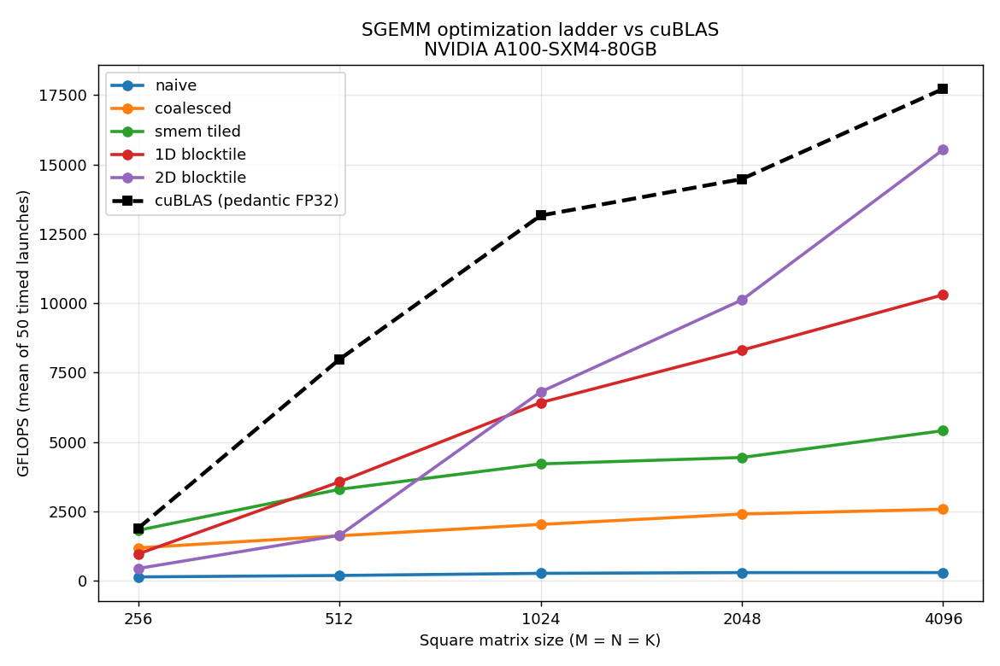

# cuda-kernel-lab

A CUDA performance-engineering project: a hand-written **SGEMM** (single-precision
matrix multiply) optimization ladder that climbs from a naive kernel to a register
block-tiled kernel reaching **87.6% of cuBLAS** on an NVIDIA A100, with every rung
validated for correctness and benchmarked against the vendor baseline with measured
numbers. The point is the *ladder*: each rung adds exactly one optimization, and the
measured jump is the evidence that it worked.

All numbers below come from actual runs captured in [`results/`](results/) on the
hardware named at the bottom. Nothing is rounded up or estimated.

## Headline result

On an **NVIDIA A100-SXM4-80GB** (CUDA 12.8), at the headline size **4096×4096×4096**,
the 2D block-tiled kernel reaches **87.6% of pedantic-FP32 cuBLAS**:

| Rung | GFLOPS (mean) | Speedup vs prev | % of cuBLAS |
|------|--------------:|----------------:|------------:|
| `sgemm_naive`        |    292 | — | 1.7% |
| `sgemm_coalesced`    |  2,574 | 8.8× | 14.5% |
| `sgemm_smem_tiled`   |  5,406 | 2.1× | 30.5% |
| `sgemm_1d_blocktile` | 10,301 | 1.9× | 58.1% |
| `sgemm_2d_blocktile` | **15,529** | **1.5×** | **87.6%** |
| cuBLAS (pedantic FP32, the basis) | 17,720 | — | 100% |
| cuBLAS TF32 (context only, lower precision) | 110,323 | — | see note |



### A note on the two cuBLAS columns

The **percentage basis is pedantic FP32** cuBLAS (`CUBLAS_PEDANTIC_MATH`): a true
IEEE single-precision matmul, the apples-to-apples comparison for these hand-written
FP32 kernels. The **TF32 column is shown only for context**. TF32 runs on the A100's
tensor cores using a 19-bit format with a 10-bit mantissa, so it is far faster
(~6× the FP32 baseline here) but *not the same computation*: its error against the
FP32 reference grows to ~2.8e-2 absolute at 4096, above the 1e-2 correctness bar these
kernels meet. It is included to show where the tensor-core ceiling sits, not as the
target the FP32 ladder is measured against.

## The ladder — one idea per rung

Each kernel lives in [`src/sgemm/kernels.cuh`](src/sgemm/kernels.cuh); older rungs are
kept in the tree because the progression *is* the project.

1. **`sgemm_naive`** — one thread per output element, plain K-loop over global memory.
   Threads in a warp walk down a column, so every global load is uncoalesced. The floor.
2. **`sgemm_coalesced`** — reindex threads so consecutive threads read consecutive
   global addresses. Loads of B and stores to C become single coalesced transactions.
   *8.8× over naive.*
3. **`sgemm_smem_tiled`** — stage a 32×32 tile of A and B in shared memory and reuse it,
   so each global element is fetched once per tile instead of once per use. *2.1×.*
4. **`sgemm_1d_blocktile`** — each thread computes a column of 8 results in registers,
   raising arithmetic intensity (more FMAs per shared-memory load). *1.9×.*
5. **`sgemm_2d_blocktile`** — each thread computes an 8×8 register tile; each
   shared-memory load now feeds 8 multiplies. The highest-intensity rung. *1.5×, 87.6%
   of cuBLAS.*

The full reasoning, tied to the measured jumps, is in
[`docs/optimization_notes.md`](docs/optimization_notes.md).

### Where the ladder is monotonic

Each rung beats the previous one at **1024, 2048, and 4096** (see the CSV). At the
smallest sizes (256, 512) the big-tile kernels (1D/2D) fall *below* the shared-memory
rung: with 128×128 block tiles a 256×256 problem launches only 4 thread blocks, far
too few to fill the A100's 108 SMs, so the larger tiles lose to occupancy. This is the
expected small-matrix tail behavior, not a regression — the optimizations are designed
to pay off on large matrices, which is exactly where the headline 4096 number sits.

## Profiling & roofline

Counter-free profiling (the box restricts GPU performance counters, so Nsight's
hardware counters were unavailable — see the note in the optimization notes; the data
below comes from `ptxas`, the CUDA occupancy API, and measured GFLOPS vs the A100's
~19.5 TFLOPS FP32 peak). Raw data: [`results/sgemm_profile.txt`](results/sgemm_profile.txt).

The headline finding: **the fastest kernel has the lowest occupancy.** As the ladder
climbs, theoretical occupancy *falls* (100% → 50% → **25%** for the 2D kernel) while
performance rises, because the 2D kernel spends registers (124/thread, no spills) on an
8×8 accumulator tile and hides latency through instruction-level parallelism rather than
many resident warps. As a % of FP32 peak the rungs read 1.5% → 13% → 28% → 53% → **80%**
(2D) vs 91% for cuBLAS — the classic roofline progression from memory bound to compute
bound. Full per-rung verdict in [`docs/optimization_notes.md`](docs/optimization_notes.md).

## Fused kernels: softmax & layernorm vs PyTorch

Two hand-written, `float4`-vectorized fused kernels over the last dimension of a
2D tensor, each validated against torch and benchmarked against the equivalent
torch op (10 warmup + 50 timed CUDA-event launches). Sources:
[`src/fused/softmax.cu`](src/fused/softmax.cu),
[`src/fused/layernorm.cu`](src/fused/layernorm.cu); full numbers in
[`results/fused_results.csv`](results/fused_results.csv). These ops are
memory bound, so the figure of merit is achieved HBM bandwidth (A100 peak ≈ 2 TB/s).

| Op | Shape | Kernel GB/s | torch GB/s | Speedup | Max abs err |
|----|-------|------------:|-----------:|--------:|------------:|
| softmax   | 4096×1024  |   976 | 1025 | 0.95× | 1.9e-09 |
| softmax   | 8192×2048  | 1,385 | 1321 | 1.05× | 9.3e-10 |
| softmax   | 16384×4096 | 1,437 | 1206 | 1.19× | 4.7e-10 |
| layernorm | 4096×1024  | 1,052 |  768 | 1.37× | 3.6e-07 |
| layernorm | 8192×2048  | 1,484 | 1236 | 1.20× | 3.6e-07 |
| layernorm | 16384×4096 | 1,496 | 1134 | 1.32× | 3.6e-07 |

The kernels reach ~70–75% of the A100's HBM2e peak and **match or modestly beat torch
at these shapes**. That is an honest but narrow claim: these are specialized
**forward-only, FP32, 2D, last-dim** kernels, whereas torch's ops are general
(autograd-ready, arbitrary dims/dtypes). The comparison is like-for-like on the forward
pass only; it is not a claim of beating PyTorch in general. Validated against
`torch.softmax` / `torch.nn.functional.layer_norm` (biased variance, eps=1e-5) within the
same 1e-2 tolerance as the SGEMM ladder.

Run with `python3 bench/bench_fused.py` (requires `torch`).

## Correctness

Every kernel is validated before any timing number is reported. The reference is
**pedantic-FP32 cuBLAS**, and [`tests/verify.py`](tests/verify.py) additionally runs an
**independent NumPy float64 cross-check** (NumPy generates the inputs, the GPU computes
the product, the result is compared against a float64 `A@B`) so correctness does not
depend on cuBLAS alone.

- Pass condition: **max absolute error < 1e-2 AND normwise relative error < 1e-2** for
  float32, at every size in the sweep.
- Measured: max absolute error peaks at **7.2e-5** (at 1024) and is **0.0** at 2048/4096;
  normwise relative error stays below **1.5e-6**. All rungs PASS the full sweep.
- Relative error is reported *normwise* (`max|C−Cref| / max|Cref|`) because per-element
  relative error is ill-posed for a random GEMM whose outputs include near-zero entries.

## Build

CMake is the primary build (it detects the GPU's compute capability at configure time —
no architecture is hardcoded); a plain Makefile is the fallback.

```bash
# CMake
cmake -B build && cmake --build build -j      # produces ./build/sgemm

# or the Makefile fallback (uses nvcc -arch=native)
make                                          # produces ./sgemm
```

Requirements: an NVIDIA GPU, the CUDA toolkit with `nvcc` and cuBLAS, and Python 3 with
`numpy` and `matplotlib` for the harness (`torch` only for the fused-kernel benchmarks).

## Run

```bash
# one kernel at one size (prints a JSON line: timing, GFLOPS, measured error)
./sgemm 2d_blocktile 4096
./sgemm --device-info

# full correctness sweep (gates on the 1e-2 tolerances)
python3 tests/verify.py

# full benchmark sweep -> results/sgemm_results.csv
python3 bench/bench_sgemm.py

# chart -> results/sgemm_chart.png
python3 bench/plot.py
```

Kernel names: `naive`, `coalesced`, `smem_tiled`, `1d_blocktile`, `2d_blocktile`,
`cublas`, `cublas_tf32`.

## Colab

If you do not have a local GPU, [`colab/run.ipynb`](colab/run.ipynb) clones the repo on a
free GPU runtime, builds with the Makefile, runs the verification and benchmark sweeps,
and displays the table and chart inline. (Nsight profiling from Phase 5 is generally
unavailable on Colab.)

## Hardware these numbers came from

| | |
|---|---|
| GPU | NVIDIA A100-SXM4-80GB |
| Compute capability | 8.0 |
| Driver / CUDA runtime | 12.8 / 12.8 |
| cuBLAS baseline | pedantic FP32 (`CUBLAS_PEDANTIC_MATH`); TF32 shown for context |
| Timing | 10 warmup + 50 timed launches, CUDA events, mean and best |

The exact GPU, driver, and CUDA version are also written into the header of
[`results/sgemm_results.csv`](results/sgemm_results.csv) so the numbers stay attributable.

## Repository layout

```
src/sgemm/kernels.cuh    all five SGEMM rungs (kept in the tree)
src/sgemm/sgemm.cu       host launcher, cuBLAS baselines, dispatch, timing, validation
src/fused/               fused softmax and layernorm kernels (vs torch)
bench/                   bench_sgemm.py, bench_fused.py, plot.py
tests/verify.py          correctness sweep + independent NumPy cross-check
results/                 sgemm_results.csv, sgemm_chart.png (real runs)
docs/optimization_notes.md   the written performance story, one section per rung
colab/run.ipynb          one-click Colab path
```
